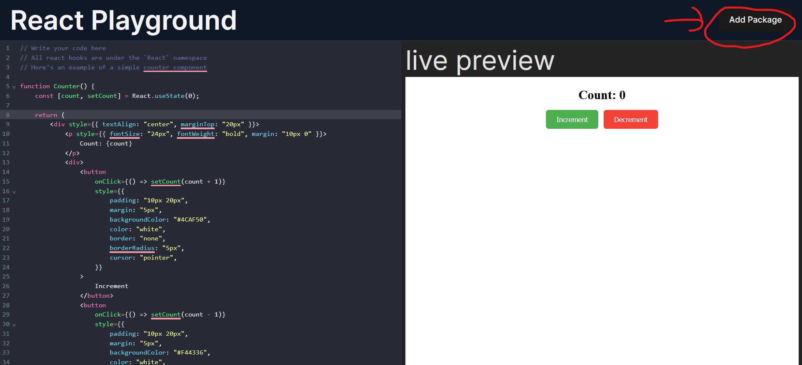

# react playground

This is a live preview enabled react playground that allows you to write react code and view the output instantly. 

It also supports using external NPM packages usign the "Add Packages" button at the topbar. All packages added are imported under the package name namespace.



For example, if I add lodash using the button, I can use it as follows:

```js
lodash.join(["hello", "world", "everyone"], "<>")
```

### setup

1. Clone the repo.

2. Install deps.

```sh
pnpm i
```

3. Run the server.

```sh
pnpm run dev
```